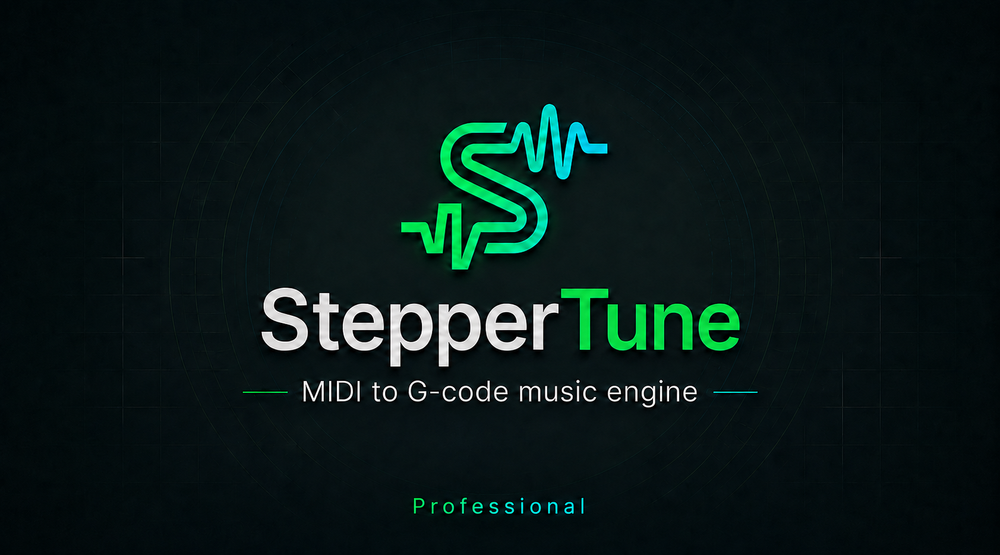

# StepperTune Professional

**Turn MIDI music into G-code and let your Bambu Lab printer play it using its stepper motors.**

StepperTune Professional is a Windows application for importing, arranging, previewing and converting MIDI music into G-code for supported Bambu Lab printers.

What started as a simple MIDI-to-G-code converter has evolved into a multi-voice music environment designed specifically around the capabilities of different Bambu Lab printer models.

Depending on the selected printer, StepperTune can generate either monophonic or polyphonic stepper music.

---

## Main Features

### 🎹 MIDI Import

- Load standard MIDI files
- Select and arrange MIDI tracks
- Convert MIDI notes and timing automatically
- Adapt musical data for stepper-motor playback

### 🎼 Multi-Voice Arrangement

StepperTune Professional supports up to three independent musical voices.

Each voice can be configured and previewed separately, allowing MIDI tracks to be arranged specifically for the printer.

On compatible printers, multiple voices can be played simultaneously to create polyphonic stepper music.

### ▶ Independent Preview

- Play / Stop each voice individually
- Play multiple selected voices together
- Preview the complete arrangement before generating G-code
- Adjustable volume for each voice

The PC preview helps balance the arrangement before sending it to the printer.

### 🔊 Monophonic and Polyphonic Modes

StepperTune automatically adapts its available functions to the selected printer.

**Monophonic mode**
- Designed for printers supporting a single musical voice
- Simplified voice controls
- MIDI-to-stepper conversion optimized for single-voice playback

**Polyphonic mode**
- Up to three independent voices
- Individual voice volume
- Simultaneous playback
- Multi-voice G-code generation

Available functionality depends on the selected printer model.

### 🧩 Printer-Specific G-code Generation

StepperTune automatically applies the appropriate sound generation method for the selected printer.

- Generate printer-ready G-code
- Export the finished music
- Use the generated sequence as part of Start G-code or End G-code
- No manual editing of individual `M1006` notes required for normal use

### 💾 StepperTune Project Files

Arrangements can be saved as StepperTune `.stf` project files and reopened later without rebuilding the MIDI configuration.

### 🔄 Update Check

- Automatic update check at application startup
- Manual `Help > Check for Updates`
- Version information retrieved online

### 📘 User Manual

Italian and English documentation is included with the application.

The manual covers the complete workflow, interface, MIDI import, voice configuration, G-code generation and Bambu Studio setup.

---

## Supported Printers

StepperTune Professional currently supports:

| Printer | Playback mode |
|---|---|
| Bambu Lab A1 | Monophonic |
| Bambu Lab A1 mini | Monophonic |
| Bambu Lab H2S | Polyphonic |
| Bambu Lab H2D | Polyphonic |
| Bambu Lab X2D | Polyphonic |
| Bambu Lab P2S | Printer-specific mode |

> Always select the correct printer model before generating G-code.

Support and available playback modes may evolve as additional printer models and firmware versions are tested.

---

## Basic Workflow

1. Select your Bambu Lab printer
2. Import a MIDI file
3. Assign and configure the desired musical voices
4. Preview individual voices or the complete arrangement
5. Adjust voice levels if necessary
6. Generate the printer-specific G-code
7. Export the finished result
8. Use it directly or add it to the printer Start / End G-code

---

## Adding Music to Bambu Studio

Generated music can be inserted into the dedicated sound section of a printer preset.

1. Open **Bambu Studio**
2. In the **Prepare** tab, select the correct printer and nozzle size
3. Click **Edit preset**
4. Enable **Advanced**
5. Open the **Machine G-code** tab
6. Locate the printer sound section in **Machine start G-code** or **Machine end G-code**
7. Replace only the existing sound block with the code generated by StepperTune
8. Save the printer preset

### Important

Do **not** replace the entire Machine start G-code or Machine end G-code.

Only replace the section dedicated to printer sound.

Preserve all G-code line breaks when copying and pasting.

Official Bambu Lab MIDI reference:

https://wiki.bambulab.com/en/A1-mini/Midi

---

## From StepperTune to StepperTune Professional

StepperTune originally started as a simple tool for creating melodies and converting MIDI tracks into printer G-code.

The Professional version expands that concept with multi-voice arrangements, printer-specific playback modes, independent voice control, project files and polyphonic stepper music on compatible printers.

Previous versions remain available in the repository release history for archival purposes.

---

## System Requirements

- Windows
- Bambu Studio
- Supported Bambu Lab printer

---

## Disclaimer

StepperTune Professional is an independent project and is not an official Bambu Lab product.

It is not affiliated with, sponsored by, or endorsed by Bambu Lab.

The application generates G-code commands that operate printer motors to produce sound. The user is responsible for selecting the correct printer model, reviewing the generated code and using it with the appropriate printer configuration.

Firmware, Bambu Studio and G-code behavior may change over time. Always verify correct operation after software or firmware updates.

Use of manually modified G-code, unsupported printers, or replacement of Machine G-code sections other than the dedicated sound block is entirely at the user's own risk.

---

## Author

**Ernesto Sorrentino**  
**DGVeLab**

Electronics • Firmware • Software • 3D Printing • Functional Engineering

---

## License

See the `LICENSE` file for details.
